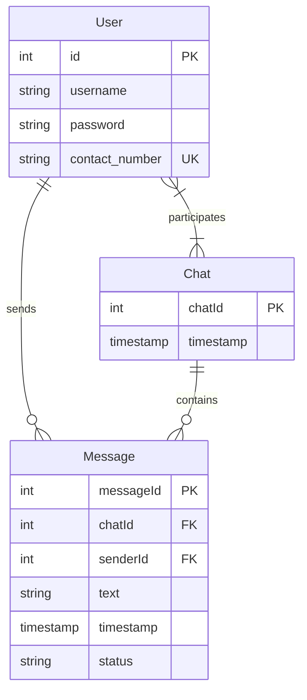
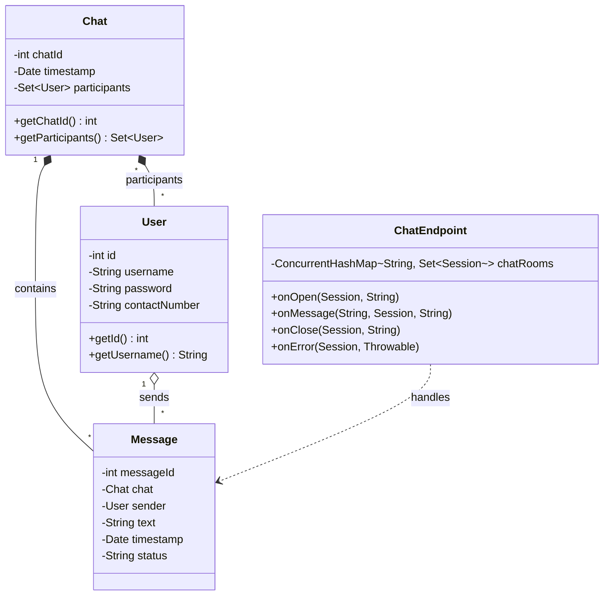

# Handheld Device Programming I - Chat Application

**Student Name:** Oshan J. Rupasinghe

---

## 1. System Architecture

The chat application employs a multi-tiered client-server architecture:

*   **Client Layer:** Developed using React Native, providing a cross-platform (iOS/Android) mobile interface. It uses native WebSockets to maintain a persistent bidirectional connection to the server for real-time capabilities.
*   **Communication Layer:** 
    *   **HTTP/REST:** Standard HTTP GET/POST/PUT methods handle user authentication, profile updates, and fetching historical chat records.
    *   **WebSocket:** Used for low-latency, real-time message broadcasting between participants.
*   **Server Layer:** A Java-based backend running on an application server (e.g., Apache Tomcat). It utilizes Java Servlets for RESTful APIs and `javax.websocket` API for the native WebSocket endpoint.
*   **Database Layer:** A MySQL relational database. The backend communicates with the database using Hibernate ORM to manage state and persistence without raw SQL queries within business logic.

---

## 2. Features

*   **User Registration & Authentication:** Secure login and sign-up flows using a mobile number and password.
*   **Real-time Messaging:** Instantaneous delivery of text messages utilizing standard WebSocket protocols.
*   **Chat History:** Persistent storage of messages, automatically fetched when opening a chat window.
*   **User Profiles:** Users can update their display names and passwords.
*   **Dark Mode UI:** A sleek, premium dark-themed interface built with standard React Native inline styling.
*   **Active Connections Management:** The WebSocket server manages concurrent client sessions and efficiently broadcasts to the intended chat room participants.

---

## 3. Diagram Specifications (Mermaid.js)

### Entity-Relationship (ER) Diagram


### Use Case Diagram
```mermaid
usecaseDiagram
    actor User as "Mobile User"
    
    package "Chat Application" {
        usecase UC1 as "Register Account"
        usecase UC2 as "Login"
        usecase UC3 as "View Chat List"
        usecase UC4 as "Send Message"
        usecase UC5 as "Receive Message"
        usecase UC6 as "Update Profile"
    }
    
    User --> UC1
    User --> UC2
    User --> UC3
    User --> UC4
    User --> UC5
    User --> UC6
```

### Class Diagram


---

## 4. Implementation Details

*   **Frontend implementation:** React Native leverages `useState` and `useEffect` hooks for managing local message history. The `WebSocket` API is used natively in the `ChatWindowScreen` to open connections like `ws://SERVER_IP:8080/chatapp/chat/{chatId}`.
*   **Backend implementation:** Java Servlets (`HttpServlet`) handle REST operations (`/login`, `/signup`, `/history`, `/users`, `/profile`). JSON serialization/deserialization is managed efficiently using Google's `Gson` library.
*   **Database ORM:** Hibernate is used to map the `User`, `Chat`, and `Message` entities to the underlying MySQL tables. Database configurations are decoupled into `hibernate.cfg.xml`.
*   **Security Measures:** The password management structure is prepared for hashing. While basic token management can be extended, the WebSocket is isolated via specific endpoint patterns restricting unauthorized broadcasting.
*   **Testing Methods:** Verified using physical Android devices on a local subnet connected via Expo Go. Backend APIs were tested via REST clients and WebSockets via the React Native implementation.
*   **Future Enhancements:** Potential upgrades include integrating JWT-based authentication for Servlet endpoints, adding multimedia support (images/audio) to messages, and implementing Push Notifications for offline alerts.
